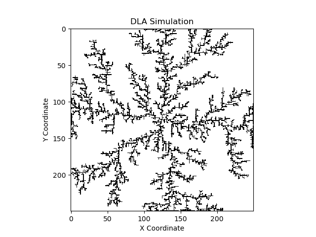
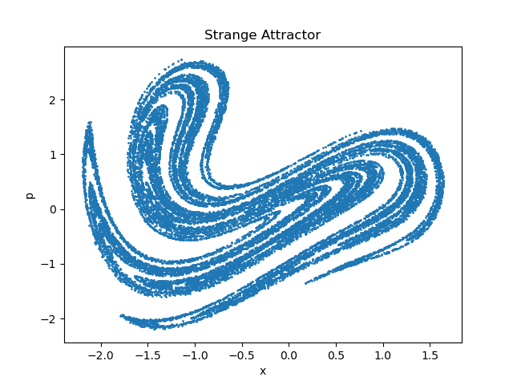

# Duffing Oscillator and Diffusion Limited Aggregation

## Overview
This project focuses on two main aspects: the Duffing Oscillator and Diffusion Limited Aggregation (DLA). It explores the chaotic behavior of a pendulum influenced by magnets (Duffing Oscillator) and models the aggregation process of particles in a lattice (DLA).

## Duffing Oscillator
- Investigates the chaotic behavior of a pendulum under magnetic influence.
- Uses the Strange Attractor to measure position and velocity of oscillations.
- Aims to determine the fractal dimension of the Strange Attractor.

## Diffusion Limited Aggregation (DLA)
- Simulates crystal aggregate growth on a lattice.
- Involves initializing a seed, starting random walkers, and drawing occupied sites.
- Analyzes the fractal dimension of dendritic clusters and their properties.

## Fractal Dimension Analysis
- Employs techniques to calculate the fractal dimension of structures observed.
- Provides insights into the complexity and scaling of fractal patterns.

## Results and Findings
- Discusses the impact of varying parameters on the Duffing Oscillator and DLA.
- Presents results on fractal dimensions, Strange Attractors, and dendritic clusters.

## Usage
To use the simulation and analysis scripts, clone this repository and run relevant python files: run1.py for the duffing oscillator and run2.py for the DLA simulation.

